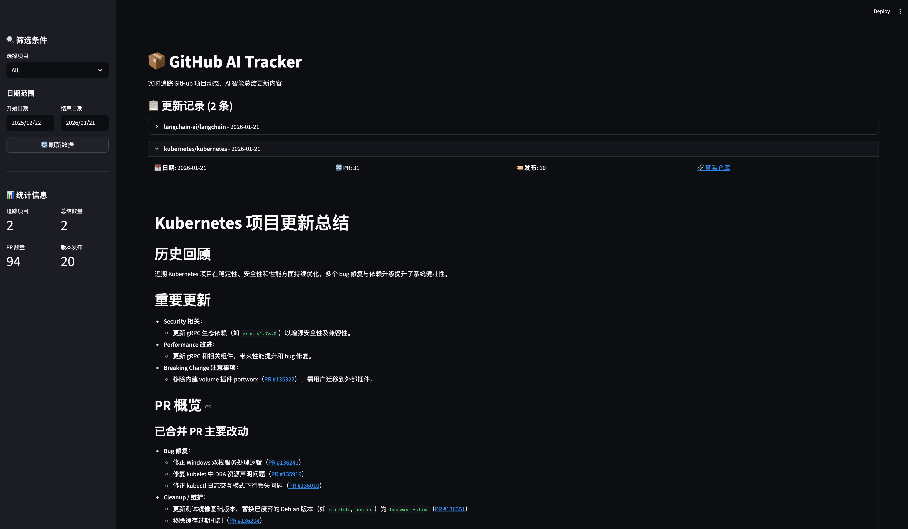

# GitHub AI Tracker

实时追踪 GitHub 项目动态，AI 智能总结更新内容。



## 功能特性

- **多仓库追踪**：支持同时追踪多个 GitHub 仓库
- **灵活的追踪级别**：
  - `all`：所有 PR + Release
  - `merged_and_release`：已合并 PR + Release
  - `release_only`：仅 Release
- **可配置频率**：`1d` / `2d` / `on_release`
- **AI 智能总结**：自动生成更新摘要，支持关键词加权
- **历史回顾**：自动压缩最近 3 次总结作为上下文
- **多种输出方式**：
  - 本地 Markdown 报告（带超链接）
  - Telegram 推送（可选）
  - Streamlit Web 看板
- **增量更新**：基于 SQLite 记录已处理内容，避免重复
- **配置热重载**：修改配置无需重启容器
- **代理支持**：GitHub API 和 Telegram 均支持 HTTP 代理

## 快速开始

### 1. 克隆项目

```bash
git clone https://github.com/FlintyLemming/github-project-tracker.git
cd github-project-tracker
```

### 2. 创建配置文件

```bash
cp config.json.example config.json
```

编辑 `config.json`：

```json
{
  "github_token": "ghp_xxxx",
  "ai": {
    "api_key": "your-api-key",
    "base_url": "https://api.openai.com/v1",
    "model": "gpt-4o-mini"
  },
  "telegram": {
    "enabled": false,
    "bot_token": "",
    "chat_id": ""
  },
  "proxy": {
    "enabled": false,
    "http_proxy": "http://127.0.0.1:7890",
    "https_proxy": "http://127.0.0.1:7890"
  },
  "repos": [
    {
      "owner": "kubernetes",
      "name": "kubernetes",
      "level": "merged_and_release",
      "frequency": "1d",
      "keywords": ["security", "performance"],
      "enable_tg": true
    }
  ]
}
```

### 3. 启动服务

```bash
docker compose up -d
```

### 4. 访问 Web 看板

打开浏览器访问 http://localhost:8501

## 配置说明

### GitHub Token

可选配置。填入后 API 限额从 60 次/小时提升至 5000 次/小时。

获取方式：GitHub → Settings → Developer settings → Personal access tokens

### AI 配置

| 字段 | 说明 |
|------|------|
| `api_key` | API 密钥 |
| `base_url` | API 地址，支持 OpenAI 兼容接口（vLLM / SGLang） |
| `model` | 模型名称 |

### 仓库配置

| 字段 | 说明 |
|------|------|
| `owner` | 仓库所有者 |
| `name` | 仓库名称 |
| `level` | 追踪级别：`all` / `merged_and_release` / `release_only` |
| `frequency` | 追踪频率：`1d` / `2d` / `on_release` |
| `keywords` | 关键词列表，AI 总结时重点关注 |
| `enable_tg` | 是否推送 Telegram |

### 代理配置

| 字段 | 说明 |
|------|------|
| `enabled` | 是否启用代理 |
| `http_proxy` | HTTP 代理地址 |
| `https_proxy` | HTTPS 代理地址 |

## 常用命令

```bash
# 启动服务
docker compose up -d

# 查看日志
docker compose logs -f tracker

# 手动执行一次追踪
docker compose run --rm tracker python -m src.main --run-once

# 追踪单个仓库
docker compose run --rm tracker python -m src.main --repo owner/name

# 重启服务
docker compose restart

# 停止服务
docker compose down
```

## 数据存储

```
data/
├── tracker.db      # SQLite 数据库
└── reports/        # Markdown 报告
    ├── owner_repo_20260121.md
    └── daily_digest_20260121.md
```

## 技术栈

- **PyGithub**：GitHub API 交互
- **OpenAI SDK**：AI 总结生成
- **APScheduler**：定时任务调度
- **Streamlit**：Web 看板
- **python-telegram-bot**：Telegram 推送
- **SQLite**：数据存储

## License

MIT
